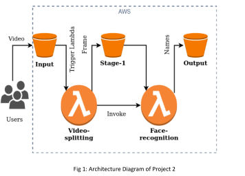

# Image_Recognition-as-a-Service

# Leveraging AWS Lambda to create a Video Analysis Application

## Summary

In this project, I developed an elastic cloud application using AWS Lambda and other PaaS cloud services. The goal was to create an application capable of automatic scaling and cost-effectiveness through serverless computing. AWS Lambda, a leading function-based serverless computing service, was utilized to build a more sophisticated cloud application compared to Project 1. This project aimed to provide a meaningful cloud service to users, while the skills and techniques learned are foundational for future cloud development endeavors.

## Description

The cloud application is a video analysis platform employing four Lambda functions to execute a multi-stage processing pipeline for user-uploaded videos:

1. **Pipeline Start (Stage 1)**:
   - Users upload videos to the designated input bucket, named `input`.
   - Upon upload, the video-splitting Lambda function is triggered.

2. **Stage 1 - Video Splitting**:
   - The video-splitting function utilizes FFmpeg to split videos into frames.
   - It saves these frames as JPG images in the `stage-1` bucket.
   - This function triggers the face-recognition function asynchronously upon completing its task.

3. **Stage 2 - Face Recognition**:
   - The face-recognition function processes the frames from Stage 1.
   - Using a Single Shot MultiBox Detector (SSD) algorithm and a pre-trained CNN model (ResNet-34), it identifies faces in the frames.
   - Recognized faces are stored as text files in the `output` bucket, with each file containing the name of the identified person.

### Architecture Diagram

### Bucket Details

- **Input Bucket (`input`)**:
  - Stores uploaded .mp4 video files.
  - Triggers the video-splitting Lambda function upon new uploads.

- **Stage-1 Bucket (`stage-1`)**:
  - Stores JPG images resulting from the video-splitting function.
  - Names of images correspond exactly to the input video names with .jpg extension.

- **Output Bucket (`output`)**:
  - Stores text files (.txt) containing recognized names of faces from Stage 2.
  - Names of text files match the original input video names with .txt extension.

### Function Details

- **Video-splitting Function**:
  - Triggered by new video uploads to `input`.
  - Uses FFmpeg to split videos into frames, storing them in `stage-1`.
  - Asynchronously invokes the face-recognition function upon completion.

- **Face-recognition Function**:
  - Triggered by the completion of video-splitting.
  - Processes each image frame to detect and recognize faces using OpenCV and ResNet-34.
  - Stores recognized names as text files in `output`.

---

This project not only enhanced my proficiency in cloud programming and PaaS but also equipped me with practical skills in implementing scalable and efficient serverless applications using AWS Lambda.
